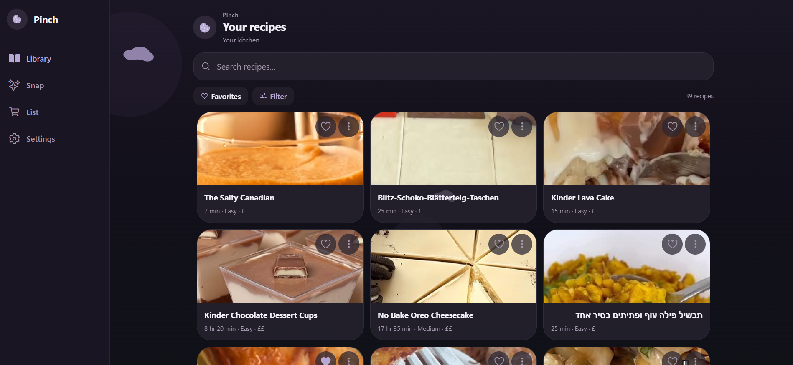
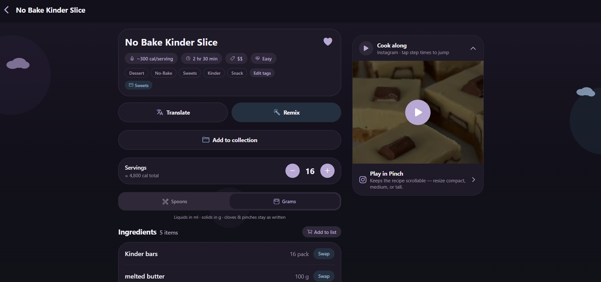
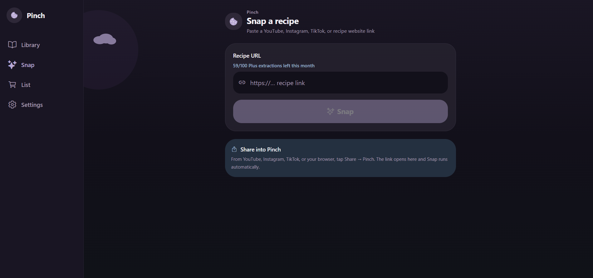
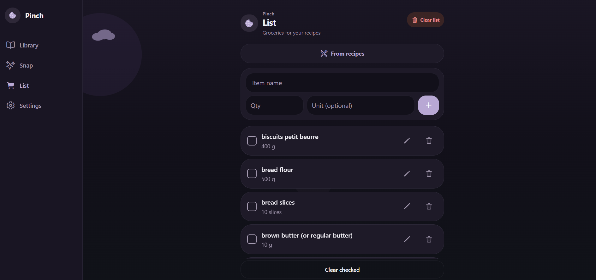

# Pinch

Pinch turns recipe videos and links into a calm, cookable kitchen on your phone — and now on the web too. Paste a URL from YouTube, Instagram, TikTok, or the web; Pinch extracts ingredients and steps, saves them to your library, and helps you shop and cook along.

## Why Pinch

- **Snap from a link** — extract a structured recipe instead of scrubbing a video
- **Your library** — search, tags, collections, favorites, and theme packs
- **Shopping list** — add ingredients and check them off at the store
- **Cook along** — play the source video beside the recipe
- **Sync** — sign in to save and keep recipes across devices (guests can try a few extractions)
- **i18n & units** — multiple languages and metric/imperial toggle

## Screenshots

Desktop web (wide viewport). On smaller screens the same flows use bottom tabs instead of the left sidebar.

| Library | Recipe |
| --- | --- |
|  |  |

| Snap | List |
| --- | --- |
|  |  |

## Quick start

1. Install dependencies

   ```bash
   npm install
   ```

2. Copy env and fill Supabase values

   ```bash
   cp .env.example .env
   ```

3. Start the app

   ```bash
   npm start          # Expo dev server
   npm run web        # Web (desktop-friendly layout)
   npm run ios        # iOS (dev client / simulator)
   npm run android    # Android
   ```

4. Run tests

   ```bash
   npm test
   ```

## Web deploy (GitHub Pages + pinch-app.io)

The app exports as a static SPA (`web.output: single`) at the domain root. GitHub still builds the site. Visitors use `https://pinch-app.io`.

Workflow: [`.github/workflows/deploy-web.yml`](.github/workflows/deploy-web.yml)

- Builds with `npx expo export -p web`
- Merges legal HTML (`privacy.html`, `terms.html`, `delete-account.html`, `delete-data.html`, `legal.html`) into `dist/`
- Adds `.nojekyll`, `404.html` (SPA fallback), and a `CNAME` for `pinch-app.io`
- Deploys via GitHub Pages

Live URL: https://pinch-app.io

### Custom domain (GoDaddy)

In the GoDaddy DNS panel for `pinch-app.io`, point the apex at GitHub Pages:

| Host | Type | Value |
| --- | --- | --- |
| `@` | A | `185.199.108.153` |
| `@` | A | `185.199.109.153` |
| `@` | A | `185.199.110.153` |
| `@` | A | `185.199.111.153` |
| `www` | CNAME | `yardenfarag.github.io` |

Remove any GoDaddy parking records on `@` that conflict with those A records. After DNS propagates, GitHub Pages provisions HTTPS. Set those records before the next deploy so `pinch-app.io` is already answering when Pages starts serving it.

If the GitHub Actions variable `EXPO_PUBLIC_LEGAL_BASE_URL` is still the old Pages URL, set it to `https://pinch-app.io`.

### Secrets & variables to configure

In the GitHub repo: **Settings → Secrets and variables → Actions**

| Name | Kind | Required | Notes |
| --- | --- | --- | --- |
| `EXPO_PUBLIC_SUPABASE_URL` | Secret | Yes | Same as local `.env` |
| `EXPO_PUBLIC_SUPABASE_KEY` | Secret | Yes | Publishable/anon key (public in the bundle; still don’t commit it) |
| `EXPO_PUBLIC_ADMIN_EMAILS` | Secret | No | Comma-separated admin emails |
| `EXPO_PUBLIC_LEGAL_BASE_URL` | Variable | No | Defaults to `https://pinch-app.io` |
| `EXPO_PUBLIC_SUPPORT_EMAIL` | Variable | No | Support mailto address |

Also ensure **Settings → Pages → Source** is **GitHub Actions**.

Do **not** put Edge Function secrets (`GEMINI_*`, YouTube, ScrapeCreators, Apple revoke keys) in this workflow — those stay in Supabase. See [`supabase/README.md`](supabase/README.md).

`EXPO_TOKEN` remains for EAS iOS/Android builds only.

### Local production web build

```bash
npm run export:web
npm run serve:web
```

### Supabase Auth redirects (web)

In Supabase → Authentication → URL Configuration, keep mobile `pinch://` entries and also allow:

- `https://pinch-app.io`
- `https://pinch-app.io/auth-callback`
- `https://pinch-app.io/reset-password`
- Dev web: `http://localhost:8081/**`

Details are mirrored in [`.env.example`](.env.example).

## Legal

- [Privacy](https://pinch-app.io/privacy.html)
- [Terms](https://pinch-app.io/terms.html)
- [Delete account](https://pinch-app.io/delete-account.html)
- [Delete data](https://pinch-app.io/delete-data.html)
- [Legal hub](https://pinch-app.io/legal.html)

## Stack

Expo SDK 54 · Expo Router · NativeWind · Supabase · i18next

## Learn more

- [Expo docs](https://docs.expo.dev/)
- Backend / Edge Functions: [`supabase/README.md`](supabase/README.md)
